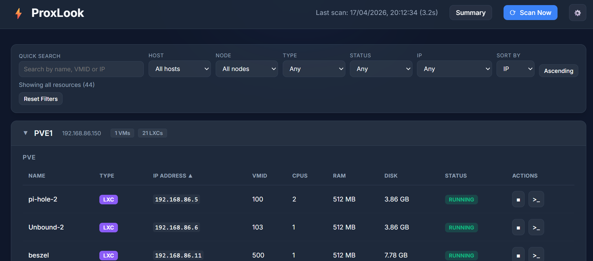

#  ProxLook

**[ProxLook](https://proxlook.beggi.be/)** is a self‑hosted web application that scans and visualizes your Proxmox VE environment in a single, clean dashboard.

Built for **homelabs**, it provides fast visibility into nodes, virtual machines, and LXC containers — with optional control and troubleshooting tools when you need them.



*ProxLook dashboard showing inventory of Proxmox VMs and LXC containers*

---

## Why ProxLook?

Proxmox provides excellent management tools, but getting a **quick, aggregated overview** of what is running across multiple nodes can be cumbersome.

ProxLook focuses on:
- **Visibility first**
- **Fast inventory**
- **Low friction deployment**
- **No mandatory automation or orchestration**

---

## Features

### Core
- **Live Inventory**
  - Automatic discovery of nodes, VMs, and LXC containers
  - Displays VMID, IP address, CPU, RAM, disk and runtime status
- **Multi‑Host Support**
  - Manage and scan multiple Proxmox VE servers
- **Filtered View**
  - Search and filter by host, node, resource type, status or IP
- **Export**
  - Download inventory data as **CSV** or **JSON**
- **Modern Web UI**
  - Dark theme
  - Responsive layout
  - Clean, distraction‑free design

### Optional / Advanced
- **Power Control**
  - Start and stop VMs and containers directly from the UI
- **In‑Browser SSH Terminal**
  - Access nodes using xterm.js + Paramiko (trusted environments only)
  - SSH button only shown for running hosts with open SSH port
  - Enter key support in password field for faster connections
  - Automatic SSH port detection (port 22 check)
- **Scheduled Scans**
  - Preset intervals or custom cron expressions

---

## Non‑Goals

ProxLook is **not** intended to:
- Replace the Proxmox Web UI
- Perform cluster configuration or orchestration
- Act as an automation or lifecycle management platform

If you need those features, the native Proxmox UI remains the authoritative tool.

---

## Installation

### 1. Clone the repository
```bash
git clone <repo-url>
cd proxlook
```

### 2. Create a virtual environment
```bash
python3 -m venv venv
source venv/bin/activate
pip install -r requirements.txt
```

### 3. Configuration
Create a `.env` file in the project root:

```env
APP_PORT=8090
DATABASE_URL=sqlite:///./proxmox_inventory.db
```

> `.env` is intentionally excluded from version control.

### 4. Run the application
```bash
python3 main.py
```

Or with `uvicorn`:
```bash
uvicorn main:app --host 0.0.0.0 --port 8090
```

### 5. Docker Deployment (Recommended)
ProxLook is available as a pre-built Docker image on Docker Hub: `abeggi/proxlook:latest`

You can deploy it easily using Docker:

#### Using Docker Compose (easiest):
```bash
# Start ProxLook with persistent data
docker-compose up -d

# View logs
docker-compose logs -f

# Stop
docker-compose down
```

#### Using Docker directly:
```bash
# Pull the latest image from Docker Hub
docker pull abeggi/proxlook:latest

# Run the container
docker run -d \
  --name proxlook \
  -p 8090:8090 \
  -v proxlook_data:/app/data \
  abeggi/proxlook:latest
```

#### For development or custom builds:
If you need to build a custom version, you can use:
```bash
# Build from source
docker build -t myproxlook:v1.0 .

# Push to your registry
docker tag myproxlook:v1.0 docker.io/yourusername/proxlook:v1.0
docker push docker.io/yourusername/proxlook:v1.0
```

### 6. Application Management

#### Direct execution (development/testing):
```bash
# Start application directly (foreground)
./run.sh start

# Stop application
./run.sh stop

# Check status
./run.sh status

# View logs
./run.sh logs

# Restart
./run.sh restart
```

#### Systemd daemon management (production):
```bash
# Install as systemd daemon (requires sudo)
sudo ./manage.sh install

# Start the daemon
sudo ./manage.sh start

# Stop the daemon
sudo ./manage.sh stop

# Check daemon status
sudo ./manage.sh status

# View daemon logs
sudo ./manage.sh logs

# Enable auto-start on boot
sudo ./manage.sh enable

# Restart daemon
sudo ./manage.sh restart

# Uninstall daemon (preserves data)
sudo ./manage.sh uninstall
```

### 8. Systemd Service Configuration service (production)
Use the included management script:
```bash
# Start the application as a background daemon
./run.sh start

# Check status
./run.sh status

# View logs
./run.sh logs

# Stop the application
./run.sh stop
```

### 8. Install as a systemd service (recommended for production)
Create `/etc/systemd/system/proxlook.service`:
```ini
[Unit]
Description=ProxLook Service
After=network-online.target
Wants=network-online.target

[Service]
Type=simple
User=root
Group=root
WorkingDirectory=/path/to/proxlook
Environment="PATH=/path/to/proxlook/venv/bin"
ExecStart=/path/to/proxlook/venv/bin/python3 /path/to/proxlook/main.py
Restart=always
RestartSec=3
StandardOutput=journal
StandardError=journal
SyslogIdentifier=proxlook

[Install]
WantedBy=multi-user.target
```

Enable and start:
```bash
systemctl daemon-reload
systemctl enable proxlook.service
systemctl start proxlook.service
systemctl status proxlook.service
```

View logs:
```bash
journalctl -u proxlook.service -f
```

---

## First Run

1. Open your browser at `http://<ip>:8090`
2. Open **Settings** (⚙️ icon)
3. Add your first Proxmox VE host

### Proxmox API Token Permissions

The API token must have at least:
- `VM.PowerMgmt`
- `VM.Audit`
- `SDN.Audit`

Permissions should be assigned on `/` with propagation enabled.

---

## Scan Frequency

You can choose between common presets or a custom cron expression.

### Custom Cron
Standard 5‑field cron format:
```
minute hour day-of-month month day-of-week
```

Example:
```
*/10 * * * *
```

Invalid expressions are rejected by the API.

---
## Configuration

### Environment Variables
ProxLook can be configured using environment variables:

| Variable | Default | Description |
|----------|---------|-------------|
| `APP_PORT` | `8090` | Port to run the web interface |
| `DATABASE_URL` | `sqlite:///./proxmox_inventory.db` | Database connection URL |
| `LOG_LEVEL` | `INFO` | Logging level (DEBUG, INFO, WARNING, ERROR) |
| `LOG_PATH` | `app.log` | Path to log file |
| `LOG_MAX_BYTES` | `5242880` | Max log file size before rotation (5MB) |
| `LOG_BACKUP_COUNT` | `5` | Number of backup log files to keep |

### Docker Configuration
When using Docker, you can pass environment variables:
```bash
docker run -d \
  -e APP_PORT=8090 \
  -e DATABASE_URL=sqlite:////app/data/proxlook.db \
  -e LOG_LEVEL=INFO \
  -p 8090:8090 \
  abeggi/proxlook:latest
```

Or use a custom `.env` file:
```bash
docker run -d \
  --env-file .env \
  -p 8090:8090 \
  abeggi/proxlook:latest
```

---
## Log Management

ProxLook includes comprehensive log management:

### Application Logs
- **Location**: `app.log` in the application directory
- **Rotation**: Daily rotation, 7 days retention (via logrotate)
- **Compression**: Automatic gzip compression of old logs
- **Format**: JSON format for easy parsing and analysis

### System Logs (when using systemd)
- **Command**: `journalctl -u proxlook.service -f`
- **Retention**: Managed by systemd-journald
- **Format**: Standard systemd journal format

### Log Configuration
Logs are configured via environment variables in `.env`:
```env
LOG_LEVEL=INFO           # DEBUG, INFO, WARNING, ERROR
LOG_PATH=app.log         # Log file path
LOG_MAX_BYTES=5242880    # 5MB max file size before rotation (Python internal)
LOG_BACKUP_COUNT=5       # Number of backup files to keep (Python internal)
```

---

## Security Model (Important)

ProxLook **does not implement authentication or built‑in security controls by design**.

The application is intended to run **behind an external reverse proxy** that provides:
- Authentication (Basic Auth, OAuth, SSO, etc.)
- TLS termination
- Network access control

Typical and fully supported setups include (but are not limited to):
- Cloudflare Tunnel / Cloudflare Access
- Nginx Proxy Manager (NPM)
- Pangolin
- Traefik
- Any standard reverse proxy with auth

Running ProxLook **directly exposed to the internet is strongly discouraged**.

---

## Recent Updates

### SSH Terminal Improvements
- **Smart SSH button visibility**: SSH terminal button now only appears for running hosts with an IP address and open SSH port (port 22)
- **Windows VM support**: Windows VMs and other hosts without SSH no longer show the SSH button
- **Auto SSH port detection**: Automatic check for SSH port availability when hosts are started
- **Keyboard shortcut**: Press Enter in the password field to trigger SSH connection
- **Real-time status**: SSH button visibility updates immediately when starting/stopping hosts

### Bug Fixes & Enhancements
- Fixed SSH button display logic for stopped hosts
- Improved IP address detection for VMs without QEMU Guest Agent
- Enhanced resource status tracking

---

## License

Open‑source.
Use it, break it, improve it.

Pull requests and feedback are welcome.
